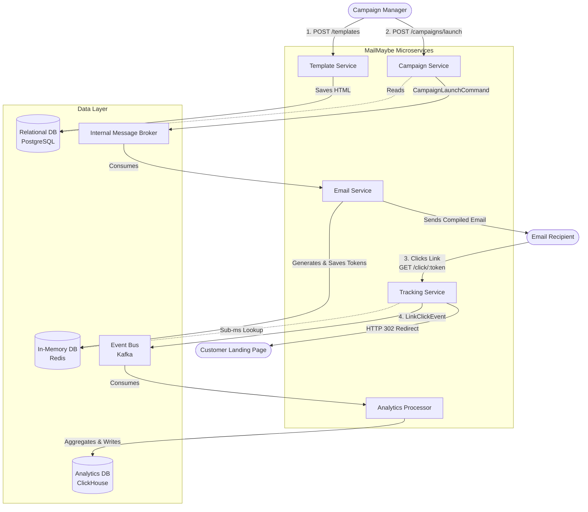
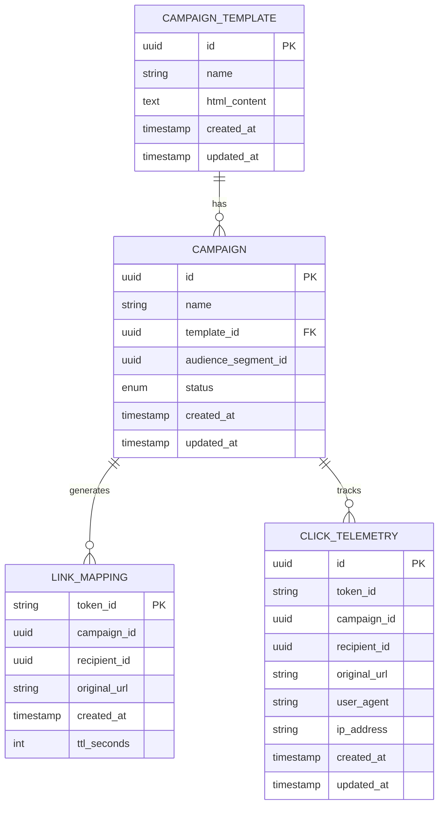

# High-Level Design (HLD): Campaign Link Tracking

**Author:** Tech Lead  
**Date:** May 26, 2026  
**Status:** Proposed  
**Project:** MailMaybe Engagement Analytics  

---

## 1. Overview

### 1.1 Purpose
This document describes the motivation and technical design for enabling Campaign Managers to measure engagement for each campaign. Today, they cannot tell whether their campaign was a success or not, nor can they understand why. By introducing link tracking, we provide visibility into recipient engagement.

### 1.2 Executive Summary
Currently, MailMaybe sends out campaigns with original customer URLs. This initiative will allow MailMaybe to automatically replace landing page URLs with MailMaybe tracking URLs. When a recipient clicks the tracking URL, MailMaybe will record the click and redirect the recipient to the original URL. 
This feature will provide the ability to track campaign engagements, allowing Campaign Managers to iterate and achieve better engagement rates. This translates to delivering better campaigns for customers, and consequently, acquiring more customers for MailMaybe.

### 1.3 Background & Context
MailMaybe is an emerging SaaS company providing an email campaign platform. Campaign managers use the platform to create, launch, and measure marketing campaigns.
* A typical campaign starts with an HTML email template including visual elements, personalized text (e.g., `{{name}}`), and links to the customer’s landing pages.
* Campaign managers select target audiences.
* MailMaybe sends a personalized email to each target contact.

**Pain Points:** Currently, once an email is sent, the Campaign Manager has a "black box." They know the emails were sent, but have zero visibility into whether recipients are actually interacting with the content.

---

## 2. Definitions & Terminology

| Term | Meaning |
| :--- | :--- |
| **Customer / Campaign Manager** | The user of MailMaybe creating and launching campaigns. |
| **Recipient / Contact** | The end-user who receives the email campaign. |
| **Redirect** | An HTTP 302 Found response that sends the recipient from the MailMaybe tracking URL to the original destination URL. |
| **Campaign Edition** | Edits made by the customer to their campaign, ideally driven by insights gained from the tracking feature. |
| **SLA / SLO** | Service Level Agreement / Service Level Objective. |
| **EDA** | Event-Driven Architecture. |

---

## 3. Stakeholders

* **Campaign Managers (Customers):** End-users who rely on accurate metrics.
* **Product Managers:** Defining the metrics, user experience, and future iterations (premium tiers).
* **Backend Engineers:** Responsible for implementing the URL rewriting, redirect service, and analytics aggregation.
* **SRE / DevOps:** Critical stakeholders due to the high availability required for the Redirect service. If redirects fail, we break customer links.

---

## 4. Goals and Non-Goals

### 4.1 Business Goals
* **Empower Campaign Managers:** Shift from just providing the "how" (sending emails) to providing the "why" (engagement analytics).
* **Increase ARR:** Package advanced metrics as a "premium license" feature to drive upsells.
* **Improve Retention:** Better metrics lead to better campaigns and increased brand reputation.

### 4.2 Technical Goals
* **High Availability Redirects:** The redirect flow must not be a single point of failure and must happen instantly, completely decoupled from analytics processing.
* **Scalable Event Processing:** Build an architecture capable of handling bursty traffic (e.g., millions of clicks in minutes following a large campaign launch).

### 4.3 Scope for V1
* **Campaign-Level Metrics:** Track total emails sent and total tracked links clicked per campaign.
* **Per-Link Breakdown:** Show which specific URLs in the campaign were clicked and how many times (e.g., URL A: 150 clicks, URL B: 75 clicks).
* **Per-Recipient Tracking:** Store granular data (recipient-level clicks) in the Analytics DB to enable future features, but DO NOT expose recipient-level analytics in the V1 dashboard.

### 4.5 Success Criteria
**What the customer should see:**
* A new engagement dashboard showing:
  * Total emails sent for the campaign
  * Total tracked links clicked (aggregate across all links)
  * Per-link breakdown (which URLs were clicked and click counts)
  * Click-through rate (CTR) = (Total Clicks / Emails Sent) × 100%

**Correctness expectations:**
* Click counts must be accurate within ±1% (allowing for rare edge cases like extreme network failures).
* Metrics may be eventually consistent (up to 5-minute delay is acceptable for analytics updates).

**Reliability expectations:**
* **Redirect Flow (Critical):** 99.99% availability. If redirects fail, customer links break — this is unacceptable.
* **Analytics Dashboard:** 99.5% availability. Brief analytics downtime is tolerable; redirect uptime is not negotiable.

**Performance expectations:**
* **Redirect Latency:** p99 < 50ms to ensure seamless user experience.
* **Dashboard Load Time:** < 2 seconds for campaign metrics page.

**Product KPIs:**
* 50%+ of active customers view the engagement dashboard within 30 days of launch.
* 20%+ increase in campaign re-sends or edits driven by insights from metrics.

### 4.6 Non-Goals (For V1)
* **Bot-Click Filtering:** Identifying and filtering out security scanners (Barracuda, Microsoft Safe Links, etc.) is deferred to V2.
* **Conversion Tracking:** Tracking user behavior after reaching the customer’s landing page (e.g., purchases, form submissions) is out of scope.
* **Custom Metric Definitions:** Customers cannot define their own KPIs or custom event tracking.
* **Exporting Metrics:** CSV downloads, API access to raw click data, or third-party integrations are not included.
* **Per-Recipient Analytics in UI:** While we store recipient-level data for future use, the V1 dashboard will NOT expose "John Doe clicked 3 times" — only campaign and link-level aggregates.

---

## 5. High-Level Architecture

To deliver this feature safely and reliably, the architecture is divided into distinct microservices based on domain boundaries.



* **Template Service:** Handles the creation and storage of campaign HTML templates, including dynamic argument mapping (e.g., `{{name}}`).
* **Campaign Service:** Orchestrates campaign execution. It resolves the target audience and triggers the Email Service via a message broker.
* **Email Service:** Responsible for compiling the final email payloads at runtime. It performs data interpolation (replacing `{{name}}` with "John"), handles URL rewriting by generating unique tokens, and dispatches the emails.
* **Tracking Service:** A highly available, public-facing service that intercepts clicks (`GET /click/{token_id}`), instantly redirects the user using data from an in-memory DB, and asynchronously publishes telemetry events.
* **Analytics Processor:** Consumes telemetry events from the Event Bus and writes them to the Analytics DB.

---

## 6. Main Flows

### 6.1 Template Creation Flow
1. Campaign Manager sends `POST /campaigns/template`.
2. **Template Service** validates and saves the template (containing raw HTML and placeholders) to the Relational DB.

### 6.2 Campaign Launch Flow & Runtime Rendering
1. Campaign Manager triggers `POST /campaigns/{id}/launch`.
2. **Campaign Service** retrieves the template and audience metadata, then drops a `CampaignLaunchCommand` onto the internal message broker.
3. **Email Service** consumes the command and begins processing the audience in memory:
   * **Data Interpolation:** Replaces `{{name}}` with specific contact data.
   * **Link Rewriting:** For every URL in the template, it generates a highly secure, unique `token_id` for that specific contact.
   * **State Storage:** It saves the `token_id` payload to the In-Memory DB (Redis) with a 90-day TTL.
   * **Dispatch:** The original URLs in the HTML are replaced with `https://mailmaybe.com/click/{token_id}`, and the email is sent via the SMTP provider.

### 6.3 Click Tracking & Redirect Flow (Decoupled)
1. Recipient clicks the generated link in their email.
2. An HTTP `GET` request hits the **Tracking Service**: `GET /click/{token_id}`.
3. **Tracking Service** performs a sub-millisecond lookup of the `token_id` in the In-Memory DB to find the `original_url`.
4. The service responds immediately with an `HTTP 302 Redirect` to the customer's landing page.
5. Asynchronously (Fire-and-Forget), the Tracking Service drops a `LinkClickEvent` onto the Event Bus (Kafka/RabbitMQ).
6. The **Analytics Processor** reads the bus and writes the record to the Analytics DB without making the end-user wait.

---

## 7. Data Models

To ensure the system is scalable, the data model is distributed across optimized datastores.



### 7.1 Relational Database (PostgreSQL)

**Owner:** Template and Campaign Services  
**Purpose:** Core campaign configuration and metadata

#### Table: `campaign_template`

```sql
CREATE TABLE campaign_template (
    id                UUID PRIMARY KEY DEFAULT gen_random_uuid(),
    name              VARCHAR(255) NOT NULL,
    html_content      TEXT NOT NULL,
    created_at        TIMESTAMP NOT NULL DEFAULT NOW(),
    updated_at        TIMESTAMP NOT NULL DEFAULT NOW()
);
```

**Key Fields:**
- `html_content`: Raw HTML blueprint with placeholders (e.g., `{{name}}`, `{{email}}`)
- Example: "Summer Promo Template" containing CTA buttons and links

---

#### Table: `campaign`

```sql
CREATE TABLE campaign (
    id                    UUID PRIMARY KEY DEFAULT gen_random_uuid(),
    name                  VARCHAR(255) NOT NULL,
    template_id           UUID NOT NULL REFERENCES campaign_template(id),
    audience_segment_id   UUID NOT NULL,
    status                VARCHAR(50) NOT NULL CHECK (status IN ('DRAFT', 'SENDING', 'COMPLETED')),
    created_at            TIMESTAMP NOT NULL DEFAULT NOW(),
    updated_at            TIMESTAMP NOT NULL DEFAULT NOW()
);

CREATE INDEX idx_campaign_template ON campaign(template_id);
CREATE INDEX idx_campaign_status ON campaign(status);
```

**Key Fields:**
- `template_id`: Links to the HTML template
- `audience_segment_id`: Points to target contact list
- `status`: Campaign lifecycle state

---

### 7.2 In-Memory DB (Redis)

**Owner:** Email Service (Writer), Tracking Service (Reader)  
**Purpose:** Sub-50ms redirect lookups

#### Key-Value Store: `link_mapping`

```json
Key: "token:{token_id}"
Value: {
    "campaign_id": "550e8400-e29b-41d4-a716-446655440000",
    "recipient_id": "7c9e6679-7425-40de-944b-e07fc1f90ae7",
    "original_url": "https://garlicrings.biz/landing123",
    "link_position": "header_cta",
    "created_at": "2026-05-26T10:30:00Z"
}
TTL: 7776000 seconds (90 days)
```

**Example:**
```
Key:   token:aB3x9Z7pQ2
Value: {"campaign_id": "550e8400...", "original_url": "https://..."}
TTL:   90 days
```

**Implementation Notes:**
- Token generation: 256-bit secure random (prevents enumeration)
- Redis cluster with read replicas for high availability
- Memory-optimized encoding (use Redis hashes for nested data)

---

### 7.3 Analytics DB (PostgreSQL)

**Owner:** Analytics Processor  
**Purpose:** High-throughput writes, fast aggregations for dashboard queries

#### Table: `click_telemetry`

```sql
CREATE TABLE click_telemetry (
    id                UUID PRIMARY KEY DEFAULT gen_random_uuid(),
    token_id          VARCHAR(64) NOT NULL,
    campaign_id       UUID NOT NULL,
    recipient_id      UUID NOT NULL,
    original_url      TEXT NOT NULL,
    user_agent        TEXT,
    ip_address_hash   VARCHAR(64),
    click_timestamp   TIMESTAMP NOT NULL DEFAULT NOW(),
    created_at        TIMESTAMP NOT NULL DEFAULT NOW()
) PARTITION BY RANGE (click_timestamp);

-- Create monthly partitions (example for May 2026)
CREATE TABLE click_telemetry_2026_05 PARTITION OF click_telemetry
    FOR VALUES FROM ('2026-05-01') TO ('2026-06-01');

CREATE TABLE click_telemetry_2026_06 PARTITION OF click_telemetry
    FOR VALUES FROM ('2026-06-01') TO ('2026-07-01');
```

**Key Fields:**
- `ip_address_hash`: SHA-256 hashed for GDPR compliance (not plaintext IP)
- `user_agent`: For bot-click filtering in future versions
- `click_timestamp`: Exact moment of click (used for partitioning and time-series queries)

**Indexes:**
```sql
-- Fast campaign-level aggregations (COUNT, GROUP BY campaign_id)
CREATE INDEX idx_click_campaign ON click_telemetry(campaign_id, click_timestamp DESC);

-- Per-link performance queries (which URLs get most clicks)
CREATE INDEX idx_click_url ON click_telemetry(campaign_id, original_url);

-- Recipient-level tracking for future features
CREATE INDEX idx_click_recipient ON click_telemetry(recipient_id, click_timestamp DESC);
```

**Partitioning Strategy:**
- Monthly partitions for efficient data retention management
- Old partitions can be dropped after 2 years: `DROP TABLE click_telemetry_2024_05;`
- Automated partition creation via cron job or pg_partman extension

---

## 8. Non-Functional Requirements (NFRs)

### 8.1 Availability
* **Tracking Service (Tier-0):** 99.99% uptime SLA. This service MUST be operational at all times because broken redirects = broken customer links.
* **Analytics Dashboard:** 99.5% uptime. Brief downtime for analytics is acceptable; the redirect flow is decoupled and unaffected.
* **Failure Isolation:** If the Analytics DB goes down, redirects continue working. The Event Bus acts as a buffer.

### 8.2 Latency
* **Redirect Response Time:** p99 < 50ms, p95 < 30ms. Achieved via:
  * Sub-millisecond Redis lookups for token resolution
  * Stateless, horizontally scaled Tracking Service
  * CDN/edge caching for the redirect endpoint (optional enhancement)
* **Dashboard Load Time:** < 2 seconds for campaign metrics page. Achieved via pre-aggregated queries in ClickHouse.

### 8.3 Data Retention
* **In-Memory DB (Redis):** 90-day TTL on token mappings. After 90 days, links expire (acceptable trade-off vs. storage cost).
* **Analytics DB (ClickHouse):** 2-year retention for raw click telemetry. Aggregated metrics retained indefinitely.
* **Rationale:** 90 days covers the typical lifecycle of a marketing campaign. Older links rarely get clicked, and customers should launch fresh campaigns rather than reusing stale links.

### 8.4 Scalability
* **Bursty Traffic Handling:** A large campaign (e.g., 10M recipients) may generate 500K clicks in the first hour. Architecture handles this via:
  * Horizontally auto-scaled Tracking Service (Kubernetes HPA based on CPU/RPS)
  * Event Bus (Kafka) with sufficient partition count to parallelize telemetry writes
  * ClickHouse's columnar storage optimized for high-throughput writes
* **Load Testing Target:** System must handle 10,000 redirects/second sustained, with burst capacity to 50,000 redirects/second.

## 9. Feature Flag and Rollout Strategy

### 9.1 Feature Flag Implementation
* **Flag Name:** `link_tracking_enabled`
* **Scope:** Per-customer (allows gradual rollout and emergency rollback)
* **Kill Switch:** `link_tracking_global_disable` (admin-only, for emergency shutdown)

### 9.2 Rollout Phases

**Phase 1: Internal Dogfooding (Week 1)**
* **Audience:** MailMaybe internal marketing team only
* **Goal:** Verify URL rewriting correctness, test redirect latency in production environment
* **Success Criteria:** 
  * All internal campaign links redirect correctly
  * p99 redirect latency < 50ms
  * Zero incidents of broken links

**Phase 2: Closed Beta (Weeks 2-3)**
* **Audience:** 5 handpicked customers (diverse campaign sizes: 1K, 10K, 100K, 500K, 1M recipients)
* **Goal:** Monitor system performance under real-world load patterns
* **Monitoring Focus:**
  * Redis memory usage and eviction rate
  * Kafka lag on telemetry topics
  * ClickHouse write throughput
  * Customer feedback on dashboard usability
* **Success Criteria:**
  * 99.99% redirect uptime
  * Analytics data appears in dashboard within 5 minutes of click
  * Positive customer feedback (NPS > 8)

**Phase 3: Gradual GA Rollout (Weeks 4-6)**
* **Week 4:** 10% of customers
* **Week 5:** 50% of customers (monitor for 3 days, halt if issues detected)
* **Week 6:** 100% of customers
* **Rollback Plan:** If redirect error rate > 0.01%, immediately disable for affected customers via feature flag

**Phase 4: Premium Tier Enablement (Week 8+)**
* Gate "per-link breakdown" and "advanced analytics" behind the Premium license tier
* Free tier shows only: total emails sent, total clicks, aggregate CTR
* Premium tier unlocks: per-link breakdown, historical trends, A/B test comparisons (future)
